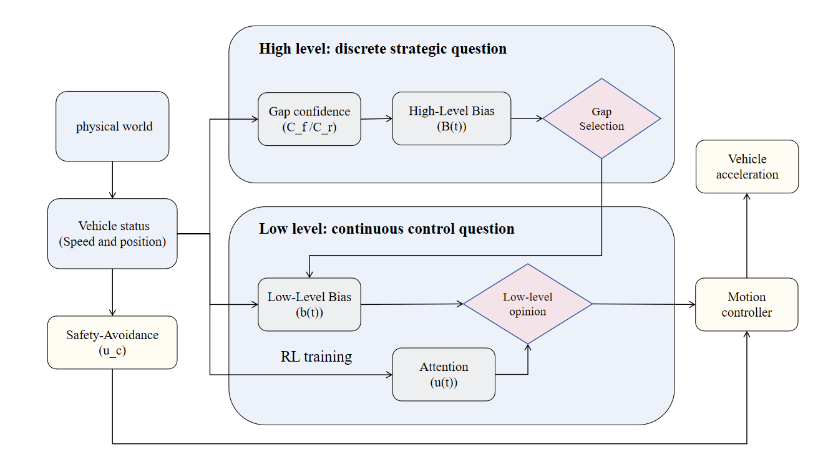

# 标题/Title

**English.**

A two-layer decision-making system for vehicle lane changing based on reinforcement learning

**中文。**

基于强化学习的车辆并道双层决策系统

# 作者/Author

Junyi Lei/雷君毅 / student ID： 14226506 / Master of Science in Robotics / Year of submission: 2026 

# 摘要/Abstract

**English.**

In the field of autonomous driving, the task of lane changing for vehicles has always been a fundamental issue. This paper proposes a two-layer decision-making and control framework for autonomous vehicles to merge into the target lane. This method splits the lane changing problem into two inter-coupled but clearly functional layers: the upper-level module is responsible for determining which local gap is more worthy of selection, while the lower-level module is responsible for converting the selected gap into continuous target points and actual vehicle control inputs. The upper-level module only reads the three closest target lane vehicles from the self-vehicle, forms two candidate gaps with these three vehicles, evaluates the relative feasibility of the two gaps through a smooth confidence function, and updates the upper-level opinion state using the opinion dynamics equation with reinforcement terms. The lower-level module further calculates the objective offset based on the size and rate of change of the selected gap, uses the SAC reinforcement learning strategy to determine the attention intensity, updates the lower-level opinion state, and maps this opinion to the target control points within the gap. Finally, the front axle point tracking controller generates vehicle acceleration and angular velocity changes.

Through building simulation experiments in the Python environment, the control method was tested. The experimental results show that in a single-gap environment, the reinforcement learning method of SAC can well learn the strategy and maintain convergence, and the vehicle can successfully complete the task; in a multi-gap environment, the strategies learned in a simple environment have been verified to be applicable in a complex environment, and the excellent performance of the two-layer decision-making system has been verified.

**中文。**

在自动驾驶领域，车辆并道任务一直是一项基本问题。本文提出一种用于自动驾驶车辆并入目标车道的双层决策与控制框架。该方法把并道问题拆分为两个相互耦合但功能清晰的层次：高层模块负责判断目标车道中哪个局部 gap 更值得选择，底层模块负责把被选中的 gap 转换为连续目标点和实际车辆控制输入。高层模块只读取距离自车最近的三辆目标车道车辆，由三车形成前后两个候选 gap，通过平滑置信度函数评价二者的相对可行性，并利用带自强化项的意见动力学方程更新高层意见状态。底层模块进一步根据所选 gap 的大小和变化速率计算客观偏置，使用 SAC 强化学习策略确定注意力强度，更新底层意见状态，并把该意见映射为 gap 内的目标控制点。最后，带安全避障项的前轴点跟踪控制器生成车辆加速度和转角变化率。

本文通过在Python环境里搭建仿真实验，对控制方法进行了测试，实验结果表明：在单gap环境中，SAC的强化学习方法能很好的学习到策略并保持收敛，车辆也能成功的完成任务；在多gap环境中，验证了简单环境学习到的策略在复杂环境下的泛用性，并验证了双层决策系统的优秀使用效果。

# Declaration of originality

I hereby confirm that no portion of the work referred to in the thesis has been submitted in support of an application for another degree or qualification of this or any other university or other institute of learning

本人特此确认，本论文中所述的任何部分内容均未被提交用于申请本校或其他任何大学或学习机构的其他学位或资格。

# Copyright statement

# 致谢/Acknowledgments

# 简介/Introduction

## 背景与动机/Background and Motivation

### 并道与换道交互中的策略决策方法/Decision-making strategies for merge and lane-change interaction

**English**

Lane changing and lane switching decisions are representative issues in autonomous driving. A lane change alters the available gaps, road right-of-way expectations, and future responses of surrounding vehicles. Therefore, in recent years, research has gradually regarded lane changing as an interactive perception decision task. Game theory models are widely used because they can explicitly describe the strategic relationship between the self-driving vehicle and surrounding vehicles. Lane changing intentions, collision probabilities, and dynamic risks can be incorporated into the payoff function to determine whether a maneuver is beneficial or dangerous [R1, R2]. Physical-inspired models such as molecular interaction potentials further express the attraction and repulsion between vehicles as continuous interaction forces [R3]. Recent studies also consider incomplete information and social driving preferences, as in lane changing conflicts involving human-driven vehicles, surrounding vehicles may exhibit cooperative, aggressive, or uncertain behaviors [R4].

Another important direction is learning-based interactive prediction. Graph neural networks and attention mechanisms represent vehicles as nodes and the influence between vehicles as edges or attention weights. This is highly suitable for lane changing scenarios, as the number and importance of surrounding vehicles will dynamically change. Existing research uses topological graphs combined with driving behavior and traffic context to predict the lane changing intentions of drivers [R5], and some studies use plan-aware graph attention networks to predict the responses of surrounding vehicles to the candidate intentions of the self-driving vehicle, and then the model predicts the control trajectory [R6]. These methods illustrate that interaction modeling should not only predict where other vehicles will go, but also estimate how they will respond to the self-driving vehicle's decision. Cooperative control methods provide a third route. In connected autonomous driving environments, surrounding vehicles can actively create gaps, coordinate lane changing sequences, or maintain fleet stability [R7, R8]. Overall, recent literature provides motivation for the hierarchical framework: this framework requires the combination of strategy interaction modeling, behavior prediction, and safe execution.

**中文**

并道与换道决策是自动驾驶中具有代表性的问题。一次换道会改变周围车辆的可用间隙、路权预期和未来响应。因此，近年研究逐渐将换道视为交互感知决策任务。博弈论模型被广泛使用，是因为它能够显式描述自车与周围车辆之间的策略关系。换道意图、碰撞概率以及动态风险等可以被纳入收益函数，用于判断某个机动是有利还是危险 [R1, R2]。分子相互作用势等物理启发模型进一步将车辆间的吸引与排斥表达为连续交互力 [R3]。近期研究还考虑不完全信息和社会驾驶偏好，因为在人类驾驶车辆参与的换道冲突中，周车可能表现为合作、激进或不确定 [R4]。

另一条重要方向是学习型交互预测。图神经网络和注意力机制将车辆表示为节点，将车辆间影响表示为边或注意力权重。这非常适合换道场景，因为周围车辆的数量和重要性会动态变化。已有研究使用拓扑图结合驾驶行为和交通上下文预测驾驶人换道意图 [R5]，也有研究利用计划感知图注意力网络预测周车对自车候选意图的响应，再由模型预测控制生成可行轨迹 [R6]。这些方法说明，交互建模不应只预测其他车辆会去哪里，还应估计它们会如何响应自车决策。协同控制方法提供了第三条路线。在网联自动驾驶环境中，周围车辆可以主动创造间隙、协调换道顺序或维持车队稳定 [R7, R8]。总体来看，近期文献为层级框架提供了动机：该框架需要结合策略交互建模、行为预测和安全执行。

### 强化学习用于自适应决策动力学/Reinforcement learning for adaptive decision dynamics

**English**

The lane-changing decision-making process exhibits sequentiality, uncertainty, and feedback-driven characteristics. Vehicles need to determine when to wait, when to change lanes, and how to adjust their speed. Traditional fixed-parameter controllers may perform well in static scenarios, but they often lack flexibility when the traffic environment changes or when the system needs to switch between cooperative consensus and competitive divergence. Deep reinforcement learning provides a mechanism for learning decision strategies through repeated interactions. Existing studies have integrated safety rules, future risk assessment, reward shaping, and robust observation modeling into DRL lane-changing strategies [R9-R11]. These studies show that RL should not be used as an unconstrained black box, but should be guided by interpretable state variables, safety-aware reward terms, and robust mechanisms.

At the same time, MARL allows each connected or autonomous vehicle to learn from the behavior of neighboring vehicles while considering group results such as traffic efficiency, comfort, and safety [R12]. Right-of-way coordination and Mix Q-learning further illustrate that the lane-changing task can balance individual benefits with group benefits [R13, R14]. For the project of this paper, these studies support a key idea: RL is not just a direct output of lane-changing actions, but can dynamically adjust the control parameters of the nonlinear decision dynamics model. This enables adaptive changes according to environmental stimuli while still maintaining connection with low-level safety control.

**中文**

换道决策具有序贯性、不确定性和反馈驱动特征。车辆需要决定何时等待、何时并道、如何调整速度。传统固定参数控制器在静态场景中可能表现良好，但当交通环境变化，或系统需要在合作共识与竞争分歧之间切换时，往往缺乏灵活性。深度强化学习提供了一种通过反复交互学习决策策略的机制。已有研究将安全规则、未来风险评估、奖励塑形和鲁棒观测建模融入 DRL 换道策略 [R9-R11]。这些研究表明，RL 不应被作为无约束黑箱使用，而应由可解释状态变量、安全感知奖励项和鲁棒机制引导。

同时 MARL 允许每辆网联或自动驾驶车辆从邻近车辆行为中学习，同时考虑交通效率、舒适性和安全性等群体结果 [R12]。路权协同和 Mix Q-learning 进一步说明，换道任务中可以平衡个体收益与群体收益 [R13, R14]。对于本论文项目而言，这些研究支持一个关键思路：RL 不只是直接输出换道动作，而是可以动态调节非线性决策动力学模型的控制参数。这样就能够根据环境刺激自适应变化，同时仍与低层安全控制保持连接。

### 评价维度：从效率到安全、舒适与适应性/Evaluation dimensions: from efficiency to safety, comfort, and adaptability

**English**

The evaluation of lane-changing decisions has shifted from a single efficiency metric to a multi-dimensional assessment. Average speed, travel time, traffic volume, and lane-changing success rate remain important, but they are not sufficient to support safety-critical autonomous driving systems. A rapid lane change can still be unsafe, uncomfortable, or disrupt the traffic flow. Therefore, recent research has begun to evaluate collision risk, minimum distance, braking feasibility, safety violation rate, acceleration, deceleration, traffic flow stability, and robustness under perception uncertainty [R7, R8, R10, R15]. This project refers to these evaluation perspectives, which emphasize convergence speed, safety violation rate, and task efficiency while also evaluating safety, comfort, and stability.

**中文**

换道决策的评价已经从单一效率指标转向多维评价。平均速度、旅行时间、通行量和换道成功率仍然重要，但它们不足以支撑安全关键的自动驾驶系统。一次快速换道仍可能是不安全、不舒适或扰动交通流的。因此，近期研究开始评价碰撞风险、最小距离、制动可行性、安全违规率、加速度、加加速度、交通流稳定性以及感知不确定性下的鲁棒性 [R7, R8, R10, R15]。本项目参考了这些评价视角，即在强调收敛速度、安全违规率和任务效率的同时，评价安全性、舒适性和稳定性。

## Aims and Objectives / 研究目标与具体目标

**English**

The aim of this project is to develop, integrate, and evaluate a hierarchical decision-making and control framework for interactive autonomous driving scenarios. This framework will use reinforcement learning to adjust the key parameters of the nonlinear decision dynamics/control model, enabling the agent to quickly make decisions in the simulation environment while meeting safety constraints.

This project includes five specific objects. First, establish a nonlinear opinion dynamics model at the policy layer. Second, train the agent using RL methods to dynamically optimize the model parameters. Third, develop a safety perception and execution layer, using control barrier functions or equivalent constraints to convert the high-level policy into collision-free trajectories. Fourth, implement the controller in the Python simulation framework. Fifth, compare with the baseline and evaluate the decision-control effectiveness.

**中文**

本项目的目标是开发、集成并评价一个面向交互式自动驾驶场景的层级决策与控制框架。该框架将使用强化学习调节非线性决策动力学/控制模型的关键参数，使智能体能够在仿真环境中快速形成决策，同时满足安全约束。

本项目包含五个具体目标。第一，建立策略层非线性意见动力学模型。第二，使用RL方法训练智能体，动态优化模型参数。第三，开发安全感知执行层，使用控制屏障函数或等价约束，将高层策略转化为无碰撞轨迹。第四，在Python仿真框架中实现控制器。第五，与基线对比，评价决策控制效果。

# 方法/Methods

**English.**

This controller adopts a two-layer structure. The upper-layer controller completes the discrete control problem of gap selection through the evaluation of different gaps and the update of opinion dynamics; the lower-layer controller, on the other hand, solves the continuous control problem of actual vehicles by using the actual size and change rate of the gap, as well as the attention parameters obtained through RL learning. 

Fig1: Block diagram of the control system structure

**中文。**

本文控制器采用双层结构。高层控制器通过对不同gap的评价以及意见动力学的更新，完成gap选择的离散控制问题；底层控制器则通过gap的实际大小与变化速率，以及通过RL学习得到的注意力参数，完成实际车辆的连续控制问题。

Fig1：控制系统结构框图/Control system structure block diagram

## 高层控制系统/High-Level Control System
### 意见动力学与自更新注意力公式/Opinion Dynamics and Self-Updating Attention

**English.**

The same opinion dynamics template [R16] is used at both levels. As shown in the following formula, for the general opinion variable \(o(t)\), its dynamics are where the damping coefficient \(d > 0\) pulls the opinion back to the neutral position to prevent it from drifting infinitely; the attention intensity \(u(t) \geq 0\) determines the degree to which the existing opinion is self-reinforced; the sensitivity parameter \(\alpha > 0\) determines the speed at which the nonlinear term enters the saturation zone; the external bias \(b(t)\) inputs the environmental evaluation into the system. If \(b(t)\) is close to zero, the damping term will cause the opinion to decay; if there is a small but persistent bias, the self-reinforcement term will gradually amplify the opinion until a stable decision is formed.

**中文。**

两个层次都使用同一种意见动力学模板[R16]。如下公式所示，对一般意见变量 \(o(t)\)，其动力学为其中阻尼系数 \(d>0\) 把意见拉回中性位置，避免意见无限漂移；注意力强度 \(u(t)\geq0\) 决定已有意见被自我强化的程度；灵敏度参数 \(\alpha>0\) 决定非线性项进入饱和区的速度；外部偏置 \(b(t)\) 把环境评价输入系统。如果 \(b(t)\) 接近零，阻尼项会使意见衰减；如果存在微小但持续的偏置，自强化项会逐渐放大意见，直到形成稳定决策。

$$
\dot{o}(t) =
-d\,o(t)
+u(t)\tanh\!\left(\alpha o(t)\right)
+b(t).
$$

**English.**

The dynamics of the opinion of top-level decision-makers can be expressed in the following form, where \(y(t)\) represents the opinion of the top-level decision-makers.

**中文。**

高层决策的意见动力学表示为以下形式，其中\(y(t)\)为高层意见

$$
\dot{y}(t) =
-d_y y(t)
+u_h(t)\tanh\!\left(\alpha_y y(t)\right)
+B(t).
$$

**English.**

In high-level decision-making, the external environment bias is determined by the gap confidence level, while attention is updated by the following formula itself. This Hill-type function depends on \(y^2\), so the opinion sign is symmetrical. When \(y(t)\) approaches zero, attention decays and the vehicle remains cautious; when \(|y(t)|\) increases, \(S_h\) rises, thereby increasing \(u_h(t)\), and a larger \(u_h(t)\) further strengthens the self-reinforcing term in the opinion equation. This feedback loop enables small but continuous preferences to gradually transform into stable gap selection.

**中文。**

在高层决策中，外部环境偏置由gap置信度决定，而注意力是由以下公式自身更新，这个 Hill 型函数依赖 \(y^2\)，因此对意见符号是对称的。当 \(y(t)\) 接近零时，注意力衰减，车辆保持谨慎；当 \(|y(t)|\) 增大时，\(S_h\) 上升，进而提高 \(u_h(t)\)，而更大的 \(u_h(t)\) 又会加强意见方程中的自强化项。这个反馈闭环使微小但连续存在的偏好能够逐渐变成稳定 gap 选择。

$$
\dot{u}_h(t) =
\frac{-u_h(t)+S_h(y(t)^2)}{\tau_h},
$$

$$
S_h(y^2) =
U_{\max}
\frac{(y^2)^n}{K_h^n+(y^2)^n}.
$$

### 高层偏置的计算/High-Level Bias from Gap Confidence

**English.**

At every time step, the high-level module selects the three target-lane vehicles closest to the ego front axle in longitudinal coordinate. Let these vehicles be ordered from front to rear as \((i_1,i_2,i_3)\). The forward candidate gap is the space between \(i_1\) and \(i_2\), and the rear candidate gap is the space between \(i_2\) and \(i_3\). For any candidate gap formed by a front vehicle \(F\) and a rear vehicle \(R\), the gap center and gap velocity are

**中文。**

每个时间步，高层模块按照纵向前轴坐标选出距离 ego 车最近的三辆目标车道车辆。将这三辆车按从前到后的顺序记为 \((i_1,i_2,i_3)\)。前方候选 gap 是 \(i_1\) 与 \(i_2\) 之间的空隙，后方候选 gap 是 \(i_2\) 与 \(i_3\) 之间的空隙。对任意由前车 \(F\) 和后车 \(R\) 构成的候选 gap，其中心位置和平均速度定义为

$$
x_g(t) =
\frac{p_F^x(t)+p_R^x(t)}{2},
$$

$$
v_g(t) =
\frac{v_F^x(t)+v_R^x(t)}{2}.
$$

**English.**

The ego-to-gap alignment is defined by the longitudinal position error and the relative speed error:

**中文。**

ego 车与该 gap 的对齐程度由纵向位置误差和相对速度误差表示：

$$
d_g(t) =
x_g(t)-p_e^x(t),
$$

$$
\Delta v_g(t) =
v_g(t)-v_e^x(t).
$$

**English.**

The confidence of a gap is then evaluated using a Gaussian radial-basis function:

**中文。**

gap 的置信度通过高斯径向基函数计算：

$$
C_g(t) =
\exp
\left(
-\frac{d_g(t)^2}{2\sigma_d^2}
-\frac{\Delta v_g(t)^2}{2\sigma_v^2}
\right).
$$

**English.**

When the gap center is close to the ego vehicle and the relative speed is low, the confidence level is higher; when the gap is spatially far apart or the speed matching is poor, the confidence level smoothly decreases. The forward and rear confidences are converted into a signed directional bias:

**中文。**

当 gap 中心接近 ego 车且相对速度较小时，置信度较大；当 gap 在空间上较远或速度匹配较差时，置信度平滑下降。前 gap 与后 gap 的置信度通过有符号差值转换为方向偏置：

$$
B(t) =
C_f(t)-C_r(t).
$$

**English.**

The use of differences here is because they retain both the direction and intensity of the preference. If \(B(t) > 0\), it indicates that the previous gap is more in line with the current ego state; if \(B(t) < 0\), it indicates that the subsequent gap is more in line; if \(B(t) \approx 0\), it means the evidence is still ambiguous. Even if the absolute values of the two confidence levels are both small, the difference between them can still represent a weak but meaningful relative preference. Through the opinion dynamics equation, this weak preference will only accumulate and gradually become more clear when it persists. This keeps the comparison process smooth and makes the decision changes more stable.

**中文。**

这里使用差值是因为差值同时保留了偏好的方向和强度。若 \(B(t)>0\)，说明前 gap 与当前 ego 状态更匹配；若 \(B(t)<0\)，说明后 gap 更匹配；若 \(B(t)\approx0\)，说明证据仍然模糊。即使两个置信度绝对值都较小，二者差值仍可能表示一个微弱但有意义的相对偏好。通过意见动力学方程，这种微弱偏好只有在持续存在时才会积累并逐渐变得明确。这让比较过程保持平滑，使决策变化更稳定。

### 高层意见更新与决策映射/High-Level Opinion Update and Decision Mapping

**English.**

The high-level opinion \(y(t)\) stores the accumulated directional belief. After computing \(B(t)\) and updating \(u_h(t)\), the system integrates the high-level opinion using an explicit time step \(\Delta t\), and update the attention:

**中文。**

高层意见 \(y(t)\) 存储已经积累的方向信念。计算 \(B(t)\) 并更新 \(u_h(t)\) 后，系统使用步长 \(\Delta t\) 对高层意见进行离散积分，并更新注意力：

$$
y_{k+1} =
y_k
+\Delta t
\left[
-d_y y_k
+u_{h,k}\tanh(\alpha_y y_k)
+B_k
\right].
$$

$$
u_{h,k+1} =
u_{h,k}
+\Delta t
\frac{-u_{h,k}+S_h(y_k^2)}{\tau_h}.
$$

**English.**

The top-level decision mapping is in the form of a threshold, and the decision is made according to the following formula.:

**中文。**

高层决策映射采用阈值形式，由以下公式做出决策：

$$
\mathrm{decision}_k =
\begin{cases}
\mathrm{forward}, & y_k>\theta_y,\\
\mathrm{rear}, & y_k<-\theta_y,\\
\mathrm{wait}, & |y_k|\leq\theta_y.
\end{cases}
$$

**English.**

The existence of the waiting interval prevents the gap selected from frequently changing when \(C_f\) and \(C_r\) are close, allowing vehicles to leave the neutral zone and make a choice only after sufficient evidence has accumulated. Therefore, this mechanism is smoother than the direct instantaneous comparison. Even if the group selection of the vehicle closest to the ego vehicle changes, the decision will not suddenly change due to a jump in confidence, which is more in line with the actual driving behavior logic.

**中文。**

等待区间的存在避免了 \(C_f\) 与 \(C_r\) 接近时所选 gap 频繁切换，使车辆只有在证据积累到足够程度后才从中性区离开并做出选择。因此，该机制比直接瞬时比较更加平滑。即使离ego车最近的车组选择发生改变，决策也不会因为置信度的跳变而瞬间改变，这也更符合实际驾驶的行为逻辑。

## 底层控制系统/Low-Level Control System

**English.**

After the high-level module selects the candidate gap, the low-level module decides how the ego vehicle should enter that gap. The low-level module first evaluates the physical feasibility of the selected gap, then determines the attention intensity, updates the low-level opinion \(z(t)\), and finally converts \(z(t)\) into continuous target points. This design makes the merging action gradual: as the low-level opinion strengthens, the target points gradually move from the original lane reference position to within the selected gap.

**中文。**
高层模块选出候选 gap 后，底层模块决定 ego 车如何进入该 gap。底层通过先评价所选 gap 的物理可行性，再确定注意力强度，更新底层意见 \(z(t)\)，最后把 \(z(t)\) 转换为连续目标点。这样的设计使并道动作是渐进的：随着底层意见增强，目标点从原车道参考位置逐渐移动到所选 gap 内。

### 底层偏置的计算/Low-Level Bias

**English.**

For a selected gap formed by a front vehicle \(F\) and a rear vehicle \(R\), the physical gap length and  gap-rate term is

**中文。**

对由前车 \(F\) 和后车 \(R\) 构成的已选 gap，其物理长度以及gap变化率为

$$
g(t) =
p_F^x(t)-p_R^x(t).
$$

$$
\dot{g}(t) =
v_F^x(t)-v_R^x(t).
$$

**English.**

The low-level bias evaluates whether the gap is sufficiently large and whether it is opening or closing:

**中文。**

底层偏置用于评价该 gap 是否足够大，以及 gap 正在变大还是变小：

$$
b(t) =
k_g\left[g(t)-g_{\mathrm{safe}}\right]
+k_v\dot{g}(t).
$$

**English.**

A larger gap makes \(b(t)\) more positive. An opening gap, where \(\dot{g}(t)>0\), also increases \(b(t)\). A small or closing gap decreases \(b(t)\), delaying the growth of the low-level merge intention. This formula is intentionally interpretable: \(g(t)-g_{\mathrm{safe}}\) measures spatial feasibility, while \(\dot{g}(t)\) measures whether the situation is improving or worsening.

**中文。**

gap 越大，\(b(t)\) 越偏正；如果 gap 正在扩大，即 \(\dot{g}(t)>0\)，\(b(t)\) 也会增大。相反，小 gap 或正在闭合的 gap 会降低 \(b(t)\)，从而推迟底层并道意愿的增长。该公式的优点是含义直观：\(g(t)-g_{\mathrm{safe}}\) 衡量空间可行性，\(\dot{g}(t)\) 衡量交通形势正在改善还是恶化。

table 1 : The influence of the gap state on the bias/表1：间隙状态对偏置的影响

| Gap condition / gap 状态 | Mathematical effect / 数学影响 | Control meaning / 控制含义 |
| :--- | :--- | :--- |
| Large and opening / 大且扩大 | \(g>g_{\mathrm{safe}},\ \dot{g}>0\) | Positive bias, stronger merge tendency; 偏置更正，并道倾向增强。 |
| Large but closing / 大但缩小 | \(g>g_{\mathrm{safe}},\ \dot{g}<0\) | Moderate bias, cautious merge tendency; 偏置受抑制，需要谨慎。 |
| Small and opening / 小但扩大 | \(g<g_{\mathrm{safe}},\ \dot{g}>0\) | Waiting may be appropriate; 可继续观察等待。 |
| Small and closing / 小且缩小 | \(g<g_{\mathrm{safe}},\ \dot{g}<0\) | Negative bias, merge should be suppressed; 偏置更负，应抑制并道。 |

### 强化学习决定注意力/The attention obtained through reinforcement learning

**English.**

The underlying attention \(u(t)\) regulates the intensity of the self-reinforcement of the underlying opinions. However, the optimal timing of attention is difficult to be fully designed manually because the system simultaneously contains nonlinear opinion dynamics, moving vehicles, safety avoidance, input saturation, and delay consequences. If attention is increased too early, the ego vehicle may overcommit when the gap is not yet safe; if attention is increased too late, the vehicle may miss the merging opportunity and behave too conservatively. Therefore, reinforcement learning is used to learn the temporal sequence of attention from the reward feedback. At the same time, the learned strategy does not replace the model controller, but only outputs the attention variables in the opinion dynamics. Such an action space is lower-dimensional and easier to interpret.

**中文。**

底层注意力 \(u(t)\) 控制底层意见自强化的强度。但注意力的最佳时机很难完全手工设计，因为系统同时包含非线性意见动力学、移动车辆、安全避障、输入饱和和延迟后果。如果注意力过早增大，ego 车可能在 gap 尚不安全时过度承诺；如果注意力过晚增大，车辆又可能错过并道机会并表现得过于保守。因此，强化学习被用于从 reward 反馈中学习注意力时序，同时学习策略并不替代模型控制器，而只是输出意见动力学中的注意力变量。这样的动作空间更低维，也更容易解释。

### SAC 强化学习设计/SAC Reinforcement Learning Design

**English.**

Soft Actor-Critic is a off-policy actor-critic algorithm suitable for continuous action spaces. It learns the random policy \(\pi_\phi(a|s)\), two soft Q functions, and the entropy temperature parameter. Its optimization objective is to balance between the expected return and the policy entropy:
The entropy term encourages exploration, which is crucial for the lane-changing task because a useful policy not only needs to learn to stay safe but also needs to learn when to actively make a lane change.

**中文。**

Soft Actor-Critic 是一种适用于连续动作空间的离策略 actor-critic 算法。它学习随机策略 \(\pi_\phi(a|s)\)、两个 soft Q 函数和熵温度参数。其优化目标在期望回报和策略熵之间进行平衡：
熵项鼓励探索，这对并道任务很重要，因为有用的策略不仅要学会保持安全，还要学会何时主动承诺并道。

$$
J(\pi) =
\sum_{t}
\mathbb{E}_{(s_t,a_t)\sim\rho_{\pi}}
\left[
r(s_t,a_t)
+\alpha_{\mathrm{SAC}}\mathcal{H}\left(\pi(\cdot|s_t)\right)
\right].
$$

**English.**

The low-level reinforcement-learning state describes the relative geometry and velocity between the ego vehicle and the front and rear vehicles of the selected gap. The typical situation is as follows. Here \(F\) and \(R\) denote the front and rear vehicles of the selected gap. 

**中文。**

底层强化学习状态描述 ego 车与所选 gap 前后两车之间的相对位置和相对速度。典型状态如下。其中 \(F\) 与 \(R\) 分别表示所选 gap 的前车和后车。

$$
s_t =
\begin{bmatrix}
\Delta x_F &
\Delta y_F &
\Delta v_F^x &
\Delta v_F^y &
\Delta x_R &
\Delta y_R &
\Delta v_R^x &
\Delta v_R^y
\end{bmatrix}^{\top}.
$$

**English.**

The policy output is the low-level attention:

**中文。**

策略输出为底层注意力：

$$
a_t =
u(t),
\qquad
u(t)\in[u_{\min},u_{\max}].
$$

**English.**

The reward is designed to encourage timely merging, discourage hesitation, penalize oscillatory motion, and strongly penalize collision. A representative per-step reward is

**中文。**

reward 的设计目标是鼓励车辆抓住机会尽快并道，抑制长时间等待，惩罚反复变速度方向的振荡行为，并对碰撞施加强惩罚。一个具有代表性的单步 reward 为

$$
\begin{aligned}
r_t
=&
w_p\,\Delta P_t
+w_o\,O_t\max(\Delta P_t,0)
-w_h\,O_t(1-P_t)
-w_s(1-P_t) \\
&
-w_a\lVert a_t-a_{t-1}\rVert_2^2
-w_f\,\mathbb{I}\!\left[v_y(t)v_y(t-1)<0\right] \\
&
-w_c
\left[
\max\left(0,\frac{d_{\mathrm{safe}}-d_{\min}(t)}{d_{\mathrm{safe}}}\right)
\right]^2
-1000\,\mathbb{I}_{\mathrm{collision}}
+R_{\mathrm{success}}(t)\,\mathbb{I}_{\mathrm{success}} .
\end{aligned}
$$

**English.**

The definition of the lane-changing progress is the normalized ratio:

**中文。**

其中并道进度定义为归一化比例：

$$
P_t =
\mathrm{clip}
\left(
\frac{y_e(t)-y_O}{y_T-y_O},
0,
1
\right),
\qquad
\Delta P_t=P_t-P_{t-1}.
$$

**English.**

The opportunity term \(O_t\) represents whether the selected gap is currently suitable for merging. The progress terms reward moving toward the target lane, especially when a useful opportunity exists. The hesitation terms penalize remaining far from the target lane, so the policy cannot receive a high score by simply waiting. The action-smoothness and direction-flip terms reduce repeated acceleration or lateral-direction reversals. The safety term is continuous before collision, while the collision term is a large terminal penalty. The success bonus decreases with time, for example

**中文。**

其中 \(O_t\) 表示当前所选 gap 是否构成有利并道机会。progress 项奖励车辆向目标车道推进，尤其在机会存在时给予更强鼓励。hesitation 项惩罚车辆长期停留在原车道附近，避免策略通过“不动”获得高分。动作平滑项和横向换向项减少反复加减速或左右方向抖动。安全项在真正碰撞前连续惩罚距离过近，碰撞项则是强终止惩罚。成功奖励随时间下降，例如

$$
R_{\mathrm{success}}(t) =
100-2t,
$$

table 2: The various meanings of the rewards/表2：奖励的各项含义

| Reward term / 奖励项 | Meaning / 含义 |
| :--- | :--- |
| \(w_p\Delta P_t\) | Rewards direct lane-change progress; 奖励横向并道进度。 |
| \(w_oO_t\max(\Delta P_t,0)\) | Gives extra reward for moving during a valid opportunity; 有机会时前进会得到额外奖励。 |
| \(-w_hO_t(1-P_t)\) | Penalizes hesitation when a gap is available; 有机会却不动会被扣分。 |
| \(-w_s(1-P_t)\) | Applies a general time/inaction penalty; 对长时间未完成并道扣分。 |
| \(-w_a\lVert a_t-a_{t-1}\rVert_2^2\) | Penalizes abrupt action changes; 惩罚动作突变。 |
| \(-w_f\mathbb{I}[v_y(t)v_y(t-1)<0]\) | Penalizes lateral direction flips; 惩罚横向速度频繁换向。 |
| Safety distance penalty / 安全距离惩罚 | Penalizes near-collision continuously; 对接近碰撞进行连续惩罚。 |
| Collision penalty / 碰撞惩罚 | Strong terminal penalty; 发生碰撞时强烈扣分。 |
| Success bonus / 成功奖励 | Rewards early safe completion; 奖励尽早安全完成。 |

### 底层意见及其对控制点的影响/Low-Level Opinion and Target Point 

**English.**

The low-level opinion \(z(t)\) represents the degree of merge commitment for the selected gap. Its dynamics and The discrete update are

**中文。**

底层意见 \(z(t)\) 表示 ego 车对所选 gap 的并道承诺程度。其动力学以及离散更新形式为

$$
\dot{z}(t) =
-d_z z(t)
+u(t)\tanh\!\left(\alpha_z z(t)\right)
+b(t).
$$

$$
z_{k+1} =
z_k
+\Delta t
\left[
-d_z z_k
+u_k\tanh(\alpha_z z_k)
+b_k
\right].
$$

**English.**

A low or negative \(z(t)\) keeps the desired target point close to the original lane or a cautious reference. A high positive \(z(t)\) moves the target point toward the selected gap in the target lane. To keep this transition bounded, \(z(t)\) is mapped through a smooth gate:

**中文。**

当 \(z(t)\) 较低或为负时，期望目标点保持在原车道参考点或谨慎位置附近；当 \(z(t)\) 增大时，目标点逐渐移动到所选 gap 内。为保证过渡有界，\(z(t)\) 先被映射为平滑门控变量：

$$
\lambda_z(t) =
\mathrm{clip}
\left(
\frac{z(t)-z_{\min}}{z_{\max}-z_{\min}},
0,
1
\right).
$$

## Actual Control Input / 实际控制输入

**English.**

The final control layer converts the desired target point into actual vehicle input. This layer consists of three parts: a safety obstacle avoidance item that pushes the ego vehicle away from the nearby target lane vehicles, a tracking error pointing to the desired target point, and a reverse solution of the bicycle model that maps the desired front axle acceleration to longitudinal acceleration and angular rate of change. Through explicit safety constraints and vehicle kinematics expressions, the entire system becomes safer and more interpretable.

**中文。**

最终控制层把期望目标点转换为实际车辆输入。该层包含三个部分：将 ego 车从附近目标车道车辆旁推开的安全避障项，指向期望目标点的跟踪误差，以及把期望前轴加速度映射为纵向加速度和转角变化率的自行车模型反解。通过显式的安全约束和车辆运动学表达，使整个系统更加安全和可解释。

### 避障项设计/Safety-Avoidance Term

**English.**

For each surrounding target-lane vehicle \(j\), define the relative vector from that vehicle to the ego front axle as

**中文。**

对每一辆周围目标车道车辆 \(j\)，定义从该车指向 ego 前轴点的相对向量为

$$
\mathbf{r}_j(t) =
\mathbf{p}_e(t)-\mathbf{p}_j(t),
\qquad
d_j(t) =
\lVert \mathbf{r}_j(t)\rVert_2.
$$

**English.**

The safety-avoidance acceleration is constructed as a repulsive field:

**中文。**

安全避障加速度构造为排斥场：

$$
\mathbf{u}_c(t) =
\sum_j
k_c
\max\left(0,\frac{d_{\mathrm{safe}}-d_j(t)}{d_{\mathrm{safe}}}\right)^2
\frac{\mathbf{r}_j(t)}{d_j(t)}.
$$

**English.**

When all vehicles are farther than \(d_{\mathrm{safe}}\), this term is zero. When a vehicle enters the safety region, the repulsive magnitude grows quadratically as distance decreases. This term does not replace collision checking; instead, it provides a continuous pre-collision correction that can steer the ego vehicle away before a hard collision boundary is reached.

**中文。**

当所有车辆距离都大于 \(d_{\mathrm{safe}}\) 时，该项为零；当某辆车进入安全区域后，排斥强度随距离减小而二次增大。该项并不替代碰撞检测，而是在真正到达硬碰撞边界前提供连续修正，使 ego 车提前远离危险区域。

### 总目标点与控制误差设计/Target Point and Tracking Error

**English.**

The selected-gap target point is usually placed near the longitudinal center of the gap and at the target-lane center. The original-lane reference point can be placed ahead of the ego vehicle along the original lane:

**中文。**

所选 gap 的目标点通常放在 gap 纵向中心附近，并位于目标车道中心线上；原车道参考点可放在 ego 车前方一定前视距离处：

$$
\mathbf{p}_G^{\star}(t) =
\begin{bmatrix}
x_g(t) \\
y_T
\end{bmatrix}.
$$

$$
\mathbf{p}_O^{\star}(t) =
\begin{bmatrix}
p_e^x(t)+\ell_{\mathrm{look}} \\
y_O
\end{bmatrix}.
$$

**English.**

The opinion-weighted target point and The tracking error are:

**中文。**

由意见加权得到的总目标点和跟踪误差为：

$$
\mathbf{p}^{\star}(t) =
\left[1-\lambda_z(t)\right]\mathbf{p}_O^{\star}(t)
+\lambda_z(t)\mathbf{p}_G^{\star}(t).
$$

$$
\mathbf{e}_z(t) =
\mathbf{p}^{\star}(t)-\mathbf{p}_e(t).
$$

**English.**

This construction gives the low-level opinion a direct geometric meaning. When \(\lambda_z(t)\) is close to zero, the controller behaves like a lane-keeping controller. When \(\lambda_z(t)\) approaches one, the controller behaves like a gap-entry controller.

**中文。**

这种构造使底层意见具有直接几何意义。当 \(\lambda_z(t)\) 接近零时，控制器近似表现为车道保持控制器；当 \(\lambda_z(t)\) 接近一时，控制器逐渐表现为 gap 并入控制器。

### 最终物理控制输入设计/Final Physical Input Design

**English.**

The desired front-axle acceleration combines proportional position tracking, velocity damping, and safety avoidance:

**中文。**

期望前轴加速度由位置比例跟踪、速度阻尼和安全避障共同组成：

$$
\mathbf{u}_{\mathrm{total}}(t) =
k_p\mathbf{e}_z(t)
-k_v\mathbf{v}_e^f(t)
+\mathbf{u}_c(t).
$$

**English.**

This vector is then converted into physical inputs. Let the front-axle velocity direction and its normal direction be

**中文。**

随后该向量被转换为实际车辆输入。令前轴速度方向及其法向方向为

$$
\mathbf{t}_e(t) =
\frac{\mathbf{v}_e^f(t)}
{\lVert\mathbf{v}_e^f(t)\rVert_2+\epsilon},
\qquad
\mathbf{n}_e(t) =
\begin{bmatrix}
-t_e^y(t) \\
t_e^x(t)
\end{bmatrix}.
$$

**English.**

The longitudinal acceleration can be approximated by projection onto \(\mathbf{t}_e\):

**中文。**

纵向加速度可通过在速度方向上的投影近似得到：

$$
a(t) =
\mathrm{clip}
\left(
\mathbf{u}_{\mathrm{total}}(t)^{\top}\mathbf{t}_e(t),
a_{\min},
a_{\max}
\right).
$$

**English.**

The steering-rate command is generated from the lateral component:

**中文。**

转角变化率由横向分量生成：

$$
\omega(t) =
\mathrm{clip}
\left(
k_{\omega}\,
\mathbf{u}_{\mathrm{total}}(t)^{\top}\mathbf{n}_e(t),
\omega_{\min},
\omega_{\max}
\right).
$$

**English.**

This kind of PID-like structure function is to provide a clear and stable mapping from the opinion-driven target point to the executable vehicle input, while avoiding unrealistic acceleration and steering changes through input clipping.

**中文。**

这种类 PID 结构作用是提供从意见驱动目标点到可执行车辆输入的清晰稳定映射，同时通过输入裁剪避免不现实的加速度和转向变化。

# 实验设计/Experimental Design

**English.**

The experiment was organized in a way from simple to complex. The single gap environment isolated the underlying issues: testing the learning effect of RL when the target gap has been determined, and whether the controller can learn when to increase attention and commit to merging. The multi-gap environment introduced high-level decisions: when multiple dynamic gaps exist simultaneously, can the system select the appropriate local gap to avoid excessive switching and safely execute merging. The specific parameters of the experiment are listed in the appendix.

**中文。**

实验按照由简单到复杂的方式组织。单 gap 环境隔离底层问题：测试当目标 gap 已经确定时，RL的学习效果以及控制器能否学会何时提高注意力并承诺并道。多 gap 环境引入高层决策：当多个动态 gap 同时存在时，系统能否选择合适的局部 gap，避免过度切换，并安全执行并道。实验具体参数表在附录中。

## 单gap并入实验/Single-Gap Merging Experiment

**English.**

The single-gap environment contains one front vehicle, one rear vehicle, and one ego vehicle. The front and rear vehicles travel in the target lane, and their longitudinal separation defines the only available merging gap. The ego vehicle starts from the original lane and attempts to merge into this gap. The lane width is \(W=4.0\,\mathrm{m}\), so the original and target lane centers are \(y_O=0.5W=2.0\,\mathrm{m}\) and \(y_T=1.5W=6.0\,\mathrm{m}\), respectively. The initial target-vehicle states are

**中文。**

单 gap 环境包含一辆目标前车、一辆目标后车和一辆 ego 车。前车与后车位于目标车道，二者之间的纵向间距构成唯一可并入 gap。ego 车从原车道出发，并尝试并入该 gap。车道宽度为 \(W=4.0\,\mathrm{m}\)，因此原车道中心为 \(y_O=0.5W=2.0\,\mathrm{m}\)，目标车道中心为 \(y_T=1.5W=6.0\,\mathrm{m}\)。目标车初始状态为

$$
x_F(0)=30.0\,\mathrm{m},\qquad
x_R(0)=15.0\,\mathrm{m},\qquad
v_F(0)=v_R(0)=15.0\,\mathrm{m/s}.
$$

**English.**

The ego vehicle has the same initial longitudinal speed but a randomized longitudinal initial position. This randomization makes the training and evaluation less dependent on one special initial alignment. It forces the policy to learn an attention schedule that works when the ego vehicle starts slightly ahead of or behind the gap center.

**中文。**

ego 车具有相同初始纵向速度，但纵向初始位置带有随机扰动，该随机化避免训练和评价只依赖某一个特殊的初始对齐位置，使策略必须在 ego 车领先或落后于gap 中心时仍能给出合理注意力时序。

$$
x_e(0)=20.0+\xi,\qquad
\xi\sim\mathcal{U}(-5.0,5.0),\qquad
y_e(0)=2.0\,\mathrm{m},\qquad
v_e(0)=15.0\,\mathrm{m/s}.
$$

**English.**

The rear vehicle is deliberately designed to create a staged merging opportunity. Before \(t_y=20.0\,\mathrm{s}\), the rear vehicle follows a sinusoidal acceleration law. Let

**中文。**

后车运动被设计成分阶段生成并道机会。在 \(t_y=20.0\,\mathrm{s}\) 之前，后车采用正弦加速度。令

$$
\omega_s=\frac{2\pi}{P_s},\qquad
P_s=6.0\,\mathrm{s},\qquad
A_s=4.0\,\mathrm{m/s}.
$$

**English.**

For \(0\leq t\leq t_y\), the rear-vehicle acceleration, velocity, and position are

**中文。**

当 \(0\leq t\leq t_y\) 时，后车加速度、速度和位置为

$$
a_R(t)=A_s\omega_s\cos(\omega_s t),
$$

$$
v_R(t)=v_R(0)+A_s\sin(\omega_s t),
$$

$$
x_R(t)=x_R(0)+v_R(0)t+\frac{A_s}{\omega_s}\left[1-\cos(\omega_s t)\right].
$$

**English.**

Since the front vehicle travels with constant speed \(v_F=15.0\,\mathrm{m/s}\), the front-rear gap before yielding is therefore

**中文。**

前车保持匀速 \(v_F=15.0\,\mathrm{m/s}\),于是让行前的前后车 gap 可写为

$$
g(t)=x_F(t)-x_R(t)
=15.0-\frac{A_s}{\omega_s}\left[1-\cos(\omega_s t)\right],
\qquad
0\leq t\leq20.0.
$$

**English.**

After \(20.0\,\mathrm{s}\), the rear vehicle starts yielding by tracking a desired front-rear gap \(g_{\mathrm{yield}}=20.0\,\mathrm{m}\). The rear-vehicle acceleration becomes:

**中文。**

在 \(20.0\,\mathrm{s}\) 之后，后车开始让行，并跟踪期望 gap \(g_{\mathrm{yield}}=20.0\,\mathrm{m}\)。后车加速度变为

$$
a_R(t)=
\mathrm{clip}
\left(
0.35\left[g(t)-20.0\right]
-1.1\left[v_R(t)-v_F(t)\right],
-5.0,
2.0
\right),
\qquad
t>20.0.
$$

**English.**

Equivalently, the gap dynamics after yielding are governed by

**中文。**

等价地，让行后的 gap 动态满足

$$
\dot{g}(t)=v_F(t)-v_R(t),
\qquad
\ddot{g}(t)=-a_R(t),
\qquad
t>20.0.
$$

**English.**

This piecewise construction has a clear purpose. Before \(20.0\,\mathrm{s}\), the gap is not intentionally opened for the ego vehicle, so the policy should avoid premature aggressive merging. After \(20.0\,\mathrm{s}\), the rear vehicle creates a larger gap and the correct behavior is to increase attention \(u(t)\), allow the opinion \(z(t)\) to grow, and move the target point toward the target lane.

**中文。**

这个分段构造具有明确实验含义。在 \(20.0\,\mathrm{s}\) 之前，目标 gap 并未主动为 ego 车打开，因此策略不应过早激进并道；在 \(20.0\,\mathrm{s}\) 之后，后车开始创造更大 gap，合理策略应提高注意力 \(u(t)\)，使意见 \(z(t)\) 增长，并把目标点推向目标车道。

**English.**

The SAC agent uses a Gaussian policy with two hidden layers of width \(256\), two Q networks, target Q networks, replay-buffer learning, and entropy regularization. The main training parameters are \(200\) episodes, replay-buffer size \(2.0\times10^5\), batch size \(256\), \(1000\) initial random steps, discount factor \(\gamma=0.99\), target-update rate \(\tau=0.005\), and learning rates \(3\times10^{-4}\) for the policy, Q networks, and entropy temperature. The subsequent value comparison is also carried out using the same "reward" as defined in the previous text. The same reward definition is used during value comparison so that the learned and hand-designed policies are judged by an identical metric.The baseline comparison evaluates the trained SAC attention against the original hand-designed RBF attention:

**中文。**

SAC agent 使用高斯策略网络、两个 Q 网络、目标 Q 网络、经验回放和熵正则化。主要训练参数为：训练 \(200\) 个 episode，经验池容量 \(2.0\times10^5\)，batch size 为 \(256\)，初始随机探索步数为 \(1000\)，折扣因子 \(\gamma=0.99\)，目标网络软更新系数 \(\tau=0.005\)，policy、Q 网络和熵温度学习率均为 \(3\times10^{-4}\)。后续价值对比也由前文定义的同一reward执行，因此学习策略和手工策略由完全一致的指标评价。对照基线为原始手工设计的 RBF 注意力：

$$
u_{\mathrm{RBF}}(t)=
u_{\mathrm{base}}+
u_{\mathrm{amp}}
\exp
\left(
-\frac{d_g(t)^2}{2\sigma_d^2}
-\frac{\Delta v_g(t)^2}{2\sigma_v^2}
\right).
$$

**English.**

The evaluation repeats the simulation \(100\) times with shared random ego initial positions. For each random seed, both policies face the same initial \(x_e(0)\) and the same target-vehicle trajectory. The comparison reports the episode reward of each trial and the mean and standard deviation across trials:

**中文。**

评价阶段重复 \(100\) 次仿真，并使用共享的随机 ego 初始位置。对每一个随机种子，SAC 策略和 RBF 策略面对完全相同的 \(x_e(0)\) 和目标车轨迹。最终比较每次 episode reward，并统计多次试验的均值与标准差：

$$
\bar{R}_{\mathrm{SAC}}=\frac{1}{N_{\mathrm{eval}}}\sum_{j=1}^{N_{\mathrm{eval}}}R_{\mathrm{SAC}}^{(j)},
\qquad
\bar{R}_{\mathrm{RBF}}=\frac{1}{N_{\mathrm{eval}}}\sum_{j=1}^{N_{\mathrm{eval}}}R_{\mathrm{RBF}}^{(j)},
\qquad
N_{\mathrm{eval}}=100.
$$

## 多gap并入实验/Multi-Gap Merging Experiment

**English.**

The multi-gap environment extends the same merging task to a target lane containing five vehicles and four physical gaps. The target vehicles are initialized with a uniform base spacing:

**中文。**

多 gap 环境把同一并道任务扩展到包含五辆目标车和四个物理 gap 的目标车道。目标车队以统一基础间距初始化：

$$
N=5,\qquad
x_i(0)=48.0-(i-1)g_0,\qquad
g_0=8.0\,\mathrm{m},\qquad
i=1,\ldots,5.
$$

**English.**

All target vehicles start on the target-lane center \(y_T=6.0\,\mathrm{m}\) with nominal speed \(15.0\,\mathrm{m/s}\). The ego vehicle starts from the original lane with a larger longitudinal randomization range than in the single-gap experiment. The larger random range changes which three vehicles are nearest to the ego vehicle at the beginning of an episode. Therefore, the high-level selector must work under different local traffic configurations rather than repeatedly facing one fixed gap.

**中文。**

所有目标车初始位于目标车道中心 \(y_T=6.0\,\mathrm{m}\)，名义速度为 \(15.0\,\mathrm{m/s}\)。ego 车从原车道出发，并且相对于单 gap 实验使用更大的纵向随机范围。更大的随机范围会改变每个 episode 开始时距离 ego 最近的三辆目标车，因此高层选择器必须面对不同的局部交通构型，而不是反复处理同一个固定 gap。

$$
x_e(0)=30.0+\xi,\qquad
\xi\sim\mathcal{U}(-10.0,15.0),\qquad
y_e(0)=2.0\,\mathrm{m},\qquad
v_e(0)=15.0\,\mathrm{m/s}.
$$

**English.**

The four target-lane gaps are randomly adjusted over time. Every \(T_g=4.0\,\mathrm{s}\), at most two gaps are selected for modification, and each selected gap receives a desired spacing from the multiplier set

**中文。**

四个目标车道 gap 会随时间随机调整。每隔 \(T_g=4.0\,\mathrm{s}\)，最多两个 gap 会被选中改变期望间距，被选中的 gap 从倍率集合中抽取一个倍率：

$$
\mathcal{M}=\{0.75,1.0,1.25,1.5\}.
$$

**English.**

The leading target vehicle has zero acceleration. Each following target vehicle tracks the desired gap in front of it through a clipped proportional-derivative rule:

**中文。**

目标车队最前车加速度为零。每一辆跟随目标车用裁剪后的 PD 规则跟踪其前方期望 gap：

$$
a_{i+1}(t)=
\mathrm{clip}
\left(
0.55\left[g_i(t)-g_{i,\mathrm{des}}^{(k)}\right]
 +1.05\dot{g}_i(t),
-4.0,
4.0
\right).
$$

**English.**

This mechanism produces a target lane in which gaps open, close, and reconfigure during the \(40.0\,\mathrm{s}\) simulation. The high-level decision module selects the nearest three target-lane vehicles in longitudinal front-axle coordinate and compares the two local gaps formed by these vehicles. The main purpose of the multi-gap experiment is to verify the generalization ability. The underlying strategy uses the attention strategy learned in the single-gap environment. This design tests whether a strategy that only learns \(u(t)\) for a single pair of preceding and following vehicles remains effective when the high-level selector continuously provides different pairs of preceding and following vehicles. If the strategy is generalizable, then even if the gap selection and gap environment change, the ego vehicle should still be able to smoothly enter the selected gap.

**中文。**

该机制使目标车道中的 gap 在 \(40.0\,\mathrm{s}\) 仿真中持续打开、闭合和重构。高层决策模块在每一步根据前轴纵向坐标选择距离 ego 最近的三辆目标车，并比较这三辆车形成的两个局部 gap。多 gap 实验的主要目的在于验证泛化能力。底层策略使用单 gap 环境中学到的注意力策略。这样的设计检验了一个只针对单个前后车 pair 学习 \(u(t)\) 的策略，在高层选择器不断提供不同前后车 pair 时是否仍然有效。如果策略具有泛化性，那么即使gap选择和gap环境在变化，ego 车仍应能够平滑进入所选 gap。

**English.**

The high-level ablation compares the opinion-dynamics selector with a simple maximum-score selector. The maximum-score baseline removes the high-level opinion memory and chooses the locally better gap instantaneously:

**中文。**

高层消融实验比较意见动力学选择器与简单最大评分选择器。最大评分基线去掉高层意见记忆，并瞬时选择局部评分更高的 gap：

$$
i_k^{\star}=\arg\max_i S_i(t_k),
$$

**English.**

where \(S_i(t_k)\) is the instantaneous confidence or gap-evaluation score of candidate gap \(i\). The proposed opinion-dynamics selector instead integrates the confidence difference over time:

**中文。**

其中 \(S_i(t_k)\) 表示候选 gap \(i\) 的瞬时置信度或 gap 评价分数。本文方法则通过意见动力学持续积分置信度差值：

$$
\dot{y}(t)=-d_y y(t)+u_h(t)\tanh(\alpha_y y(t))+C_f(t)-C_r(t).
$$

**English.**

This comparison was evaluated through multiple random ablation experiments. The current test setup uses \(N_{\mathrm{test}} = 100\) random runs. For each method, the total reward and the number of times the selected gap was switched were compared.

**中文。**

该对比通过多次随机消融试验评价。当前测试设置使用 \(N_{\mathrm{test}}=100\) 次随机运行。对每种方法，对比总reward和被选 gap 切换次数。

# 结果和讨论/Results and discussion

## 单gap SAC 训练/Single-gap SAC Training
   
**English.**

The training results show that in the initial 50 episodes, the algorithm conducted extensive exploration, resulting in significant fluctuations in the reward. The algorithm converged after 50 episodes. The SAC agent converged within 50 episodes, achieving a stable episodic reward of 230±10 (Figure X). The Q1-loss decreased from an initial peak of 134 to below 20, indicating accurate value function    approximation. The entropy coefficient α decayed monotonically from 0.96 to 0.12, confirming a smooth transition from exploration to exploitation. The policy consistently reached the target gap (progress ≥ 0.95) with a 97.5% success rate (195/200) and zero collisions. The average control command (mean_u) stabilized around 1.9, suggesting an efficient, non-conservative driving policy. These results demonstrate that SAC effectively learns a robust and safe gap-acceptance strategy.

**中文。**

训练结果显示，在初始的50个episodes里，算法进行了广泛的探索，导致reward波动剧烈，在50个episodes后完成收敛，获得稳定的回合奖励为230±10。Q1损失从初始峰值134下降至低于20，表明价值函数逼近准确。熵系数α从0.96单调衰减至0.12，证实了从探索到利用的平滑过渡。策略持续达到目标间隙（进展≥0.95），成功率达到97.5%（195/200），且无碰撞发生。平均控制指令（mean_u）稳定在约1.9，表明驾驶策略高效且非保守。这些结果表明，SAC能够有效学习出一种稳健且安全的间隙接受策略。

## 与基线 RBF 控制器的对比/Comparison with Baseline RBF Controller

**English.**

Compared with the manually designed baselineThe, quantitative results are summarized in Table 1. The SAC policy achieves a significantly higher average episodic reward ($\bar{R}_{\mathrm{SAC}} = 233.4 \pm 4.2$) compared to the RBF baseline ($\bar{R}_{\mathrm{RBF}} = 115.8 \pm 2.1$), yielding an average improvement of approximately +117.6 points.

While both policies maintained a 100% success rate (progress ≈ 0.95) and zero collisions, the most distinctive difference lies in task efficiency. The SAC policy completes the gap‑acceptance maneuver in $6.9 \pm 0.2$ seconds on average. In contrast, the RBF controller consistently consumes 29.45 seconds per trial, which is remarkably close to the predefined simulation time limit. This indicates that the hand‑crafted RBF rule, while safe, is overly conservative and fails to exploit the available longitudinal motion capability. Conversely, the SAC agent learns an aggressive yet safe strategy, reducing task completion time by over 75%.

Regarding safety metrics, the RBF baseline maintains a larger minimum distance to the target vehicle ($d_{\min} \approx 9.7$ m), reflecting its inherent conservatism. The SAC policy operates closer to the obstacle ($d_{\min} \approx 2.6$ m), yet consistently stays outside the collision radius, demonstrating that the learned policy effectively balances time efficiency and collision avoidance through the optimized reward structure.

**中文。**

与手工设计的基线相对比，定量结果如表所示。SAC 策略获得了显著更高的平均 episodic reward（$\bar{R}_{\mathrm{SAC}} = 233.4 \pm 4.2$），而 RBF 基线仅为（$\bar{R}_{\mathrm{RBF}} = 115.8 \pm 2.1$），平均提升了约 +117.6 分。尽管两种策略均实现了 100% 的成功率（progress ≈ 0.95）且无碰撞，最显著的差异体现在任务执行效率上。SAC 策略平均仅需 $6.9 \pm 0.2$ 秒即可完成换道间隙选择。相比之下，RBF 控制器每轮测试均消耗 29.45 秒，这非常接近预设的仿真时间上限（30 秒）。这表明，尽管 RBF 手工规则保证了安全，但策略过于保守，未能充分利用车辆的纵向运动能力。而 SAC 智能体则学会了激进但安全的策略，将任务完成时间缩短了超过 75%。在安全性指标方面，RBF 基线保持了更大的最小距离（$d_{\min} \approx 9.7$ m），反映了其固有的保守性。SAC 策略虽然更接近障碍物（$d_{\min} \approx 2.6$ m），但始终保持在碰撞半径之外，证明学习到的策略能够通过优化的奖励结构有效平衡时间效率与避碰安全性。

Table 1: Performance comparison between SAC and RBF controllers (mean ± std, over 100 trials)

| Metric | SAC Policy | RBF Baseline | Improvement |
| :--- | :--- | :--- | :--- |
| **Episodic Reward** ($\bar{R}$) | **$233.4 \pm 4.2$** | $115.8 \pm 2.1$ | **+101.5%** |
| **Task Time (s)** | **$6.9 \pm 0.2$** | $29.45 \pm 0.0$ | **-76.6%** |
| **Success Rate** | 100% | 100% | — |
| **Collision Rate** | 0% | 0% | — |
| **Min. Distance (m)** | $2.62 \pm 0.23$ | $9.70 \pm 0.01$ | — |

## 多间隙泛化/Multi-Gap

**English.**

The low-level SAC strategy was trained in a single-gap environment and then directly deployed to a dynamic multi-gap scenario. The experimental results show that it has good generalization ability in terms of safety and task completion: the success rate remains at a high level (≈0.97). Even if the high-level selector switches, in the vast majority of cases, the low-level strategy never violates the safety boundary. These data confirm that the SAC strategy has a generalization ability.

Although the reward remained consistent with that in the single-gap experiment in most cases, in some special circumstances, the strategy might deteriorate and lead to failure. Through the analysis of the experimental data of failures and low rewards, the specific reasons mainly fall into two aspects: the repeated decision-making caused by the complex environment, resulting in a long decision-making time exceeding the maximum simulation time and leading to task failure; and the decision being at a local optimal solution, resulting in overly cautious actions and excessive time spent, thereby causing a serious deduction in the step term. The reasons for the decline in generalization performance may be that too little environmental information was input during training, and only the instantaneous state was focused on while ignoring the changes on the time scale.

**中文。**

将低级SAC策略在单间隙环境中进行训练，随后被直接部署到动态多间隙场景中。实验结果表明其在安全性和任务完成方面具有良好的泛化能力：成功率保持较高水平（≈0.97）。即使高层选择器切换，在绝大多数情况下，低级策略也从未违反安全边界。这些数据证实，SAC策略已具备一种可泛化的能力。

虽然reward在大部分实验里保持与单gap一致，但在部分特殊情况下，策略可能发生退化并导致失败，通过对失败和低reward的实验数据分析，其具体原因主要分为两个方面：复杂环境带来的决策反复变动，导致决策时间过长，超过最大仿真时间导致任务失败，以及决策处于局部最优解，导致动作过于谨慎和并入时间过长，进而在步长项上扣分严重。产生这些泛化性能下降的原因可能是在训练中输入环境信息太少，且只关注瞬时状态而忽略在时间尺度上的变化。

## 高层决策消融实验/High-level decision-making Ablation experiment

**English.**

By comparing two high-level decision-making strategies: the Opinion strategy (which provides recommendations based on the attention mechanism) and the Max strategy (which selects the gap that maximizes a certain indicator), the Opinion strategy achieved significantly higher average rewards (+55.3%), indicating that the gap selected by the Opinion strategy is superior to the Max strategy in terms of safety, stability, and overall returns. Although the Max strategy completed tasks in a shorter time (average 8.2 seconds compared to 12.6 seconds) in some cases, its low rewards mainly resulted from larger safety penalties and less smooth control, reflecting that the selected gap might be too aggressive or not conducive to the smooth execution of the underlying strategy. In terms of the number of switches, the Opinion strategy had an average of fewer switch times (0.61 vs 0.76), indicating that the gap suggestions provided by the Opinion strategy have better temporal consistency, reducing the control jitter caused by frequent switching of targets, and facilitating the improvement of passenger comfort and algorithm stability. The success rate of the Opinion strategy (97%) was slightly lower than that of the Max strategy (100%), mainly due to timeout failures caused by exceeding the maximum simulation time. In summary, the Opinion strategy outperformed the Max strategy in terms of total rewards and switch stability, verifying that the high-level decision-making based on attention can more effectively guide the underlying strategy and generate more stable lane-changing behaviors.

**中文。**

通过对比了两种高层决策策略：Opinion 策略（基于注意力机制给出的推荐间隙）与 Max 策略（选择最大化某一指标的间隙）。Opinion 策略取得了显著更高的平均奖励（+55.3%），表明其选择的间隙在 安全性、平稳性和整体收益上优于 Max 策略。尽管 Max 策略在某些情况下完成时间更短（平均 8.2 s 对比 12.6 s），但其低奖励主要源于较大的安全惩罚和不够平滑的控制，反映出所选间隙可能过于激进或不利于底层策略平稳执行。在切换次数上，Opinion 策略平均切换次数更少（0.61 vs 0.76），说明其提供的间隙建议具有更好的时间一致性，减少了因频繁切换目标导致的底层控制抖动，有利于提升乘坐舒适性和算法稳定性。Opinion 策略的成功率（97%）略低于 Max（100%），主要原因是超过最大仿真时间导致的超时失败。综合来看，Opinion 策略在总奖励和切换稳定性上均优于 Max 策略，验证了基于注意力的高层决策能更有效地引导底层策略，产生更平稳的换道行为。

| Metric | Opinion Strategy | Max Strategy | Improvement |
| :--- | :--- | :--- | :--- |
| **Mean Episode Reward** (\(\bar{R}\)) | 196.8 | 126.7 | **+55.3%** |
| **Mean Switch Count** | 0.61 | 0.76 | **-19.7%** |
| **Mean Completion Time (s)** | 12.6 | 8.2 | — |
| **Success Rate** | **97%** | 100% | — |

# 结论/Conclusions

**English.**

The two-layer opinion dynamics framework provides an interpretable and experimentally verifiable method for automatic lane merging. The upper layer makes a choice in the local candidate gap by smoothing the confidence difference and self-updating attention; the lower layer executes the selected action through objective gap bias, learning or parsing attention, opinion-driven target point interpolation, and tracking control with safety obstacle avoidance. 

Comprehensive experiments show that the SAC lower strategy trained in a single-gap scenario using this framework can converge stably and significantly outperform the manually designed RBF controller, verifying the advantages of learning-based strategies in balancing efficiency and safety. In the multi-gap generalization test, the lower strategy maintains a high safety success rate, demonstrating its certain generalization ability; however, in some difficult scenarios, there is a decrease in efficiency or timeout failure, indicating that the current lower strategy's adaptability to dynamic switching environments is still insufficient. The main reason lies in the lack of temporal context information in the state space during training and the inability of the lower layer to perceive the switching of the upper layer or detect the unfeasibility of the gap. The decision-making ablation experiment of the attention-based Opinion strategy shows that it outperforms the Max strategy in total rewards and has fewer switching times, indicating that reasonable upper-layer guidance can effectively improve overall performance.

**中文。**
双层意见动力学框架为自动并道提供了一种可解释且便于实验验证的方法。高层通过平滑置信度差值和自更新注意力在局部候选 gap 中做选择；底层通过客观 gap 偏置、学习或解析注意力、意见驱动的目标点插值，以及带安全避障的跟踪控制来执行所选动作。

综合实验表明，该框架在单间隙场景中训练得到的 SAC 底层策略能够稳定收敛，并显著优于手工 RBF 控制器，验证了学习型策略在效率与安全性平衡上的优势。在多间隙泛化测试中，底层策略保持了较高的安全成功率，证明其具备一定的泛化能力；但部分困难场景下出现效率退化或超时失败，说明当前底层策略对动态切换环境的适应性仍有不足，其主要原因在于训练时状态空间缺乏时间上下文信息，且底层无法感知高层切换或反馈间隙不可行性。高层决策消融实验显示，基于注意力的 Opinion 策略在总奖励上优于 Max 策略，且切换次数更少，表明合理的高层引导能有效提升整体性能。

# 参考文献/References

R1. Qu, D., Zhang, K., Song, H., Jia, Y., & Dai, S. (2022). Analysis and Modeling of Lane-Changing Game Strategy for Autonomous Driving Vehicles. *IEEE Access, 10*, 69531-69542. https://doi.org/10.1109/access.2022.3187431

R2. Deng, Z., Hu, W. S., Sun, C., Chu, D., Huang, T., Li, W., Yu, C., Pirani, M., Cao, D., & Khajepour, A. (2025). Eliminating Uncertainty of Driver's Social Preferences for Lane Change Decision-Making in Realistic Simulation Environment. *IEEE Transactions on Intelligent Transportation Systems, 26*, 1583-1597. https://doi.org/10.1109/tits.2024.3512784

R3. Zhang, K., Qu, D., Song, H., Wang, T., & Dai, S. (2022). Analysis of Lane-Changing Decision-Making Behavior and Molecular Interaction Potential Modeling for Connected and Automated Vehicles. *Sustainability, 14*, 11049. https://doi.org/10.3390/su141711049

R4. Yang, L., Cao, C., Zhao, Q., Yang, J., & Fan, A. (2026). Lane-Changing Strategy for Autonomous Vehicle With Adaptive Adjustment of Decision-Making Preference Based on Game Theory. *IEEE Transactions on Vehicular Technology, 75*, 130-144. https://doi.org/10.1109/tvt.2025.3592221

R5. Huang, T., Fu, R., Sun, Q., Deng, Z., Liu, Z., Jin, L., & Khajepour, A. (2024). Driver lane change intention prediction based on topological graph constructed by driver behaviors and traffic context for human-machine co-driving system. *Transportation Research Part C: Emerging Technologies, 160*, 104497. https://doi.org/10.1016/j.trc.2024.104497

R6. Yang, K., Li, S., Wang, M., & Tang, X. (2025). Interactive Decision-Making Integrating Graph Neural Networks and Model Predictive Control for Autonomous Driving. *IEEE Transactions on Intelligent Transportation Systems, 26*, 6991-7005. https://doi.org/10.1109/tits.2025.3532936

R7. Jiang, Y., Man, Z., Wang, Y., & Yao, Z. (2024). Cooperative lane-changing for connected autonomous vehicles merging into dedicated lanes in mixed traffic flow. *Expert Systems with Applications, 252*, 124163. https://doi.org/10.1016/j.eswa.2024.124163

R8. Monteiro, F. V., & Ioannou, P. A. (2023). Safe autonomous lane changes and impact on traffic flow in a connected vehicle environment. *Transportation Research Part C: Emerging Technologies, 151*, 104138. https://doi.org/10.1016/j.trc.2023.104138

R9. Lv, K., Pei, X., Chen, C., & Xu, J. (2022). A Safe and Efficient Lane Change Decision-Making Strategy of Autonomous Driving Based on Deep Reinforcement Learning. *Mathematics, 10*, 1551. https://doi.org/10.3390/math10091551

R10. Deng, H., Zhao, Y., Wang, Q., & Nguyen, A.-T. (2023). Deep Reinforcement Learning Based Decision-Making Strategy of Autonomous Vehicle in Highway Uncertain Driving Environments. *Automotive Innovation, 6*, 438-452. https://doi.org/10.1007/s42154-023-00231-6

R11. He, X., Yang, H., Hu, Z., & Lv, C. (2023). Robust Lane Change Decision Making for Autonomous Vehicles: An Observation Adversarial Reinforcement Learning Approach. *IEEE Transactions on Intelligent Vehicles, 8*, 184-193. https://doi.org/10.1109/tiv.2022.3165178

R12. Zhou, W., Chen, D., Yan, J., Li, Z., Yin, H., & Ge, W. (2022). Multi-agent reinforcement learning for cooperative lane changing of connected and autonomous vehicles in mixed traffic. *Autonomous Intelligent Systems, 2*. https://doi.org/10.1007/s43684-022-00023-5

R13. Zhang, J., Chang, C., Zeng, X., & Li, L. (2023). Multi-Agent DRL-Based Lane Change With Right-of-Way Collaboration Awareness. *IEEE Transactions on Intelligent Transportation Systems, 24*, 854-869. https://doi.org/10.1109/tits.2022.3216288

R14. Bi, X., He, M., & Sun, Y. (2025). Mix Q-Learning for Lane Changing: A Collaborative Decision-Making Method in Multi-Agent Deep Reinforcement Learning. *IEEE Transactions on Vehicular Technology, 74*, 8664-8677. https://doi.org/10.1109/tvt.2025.3533006

R15. Li, A., Chavez Armijos, A. S., & Cassandras, C. G. (2025). Robust optimal lane-changing control for Connected Autonomous Vehicles in mixed traffic. *Automatica, 174*, 112169. https://doi.org/10.1016/j.automatica.2025.112169

R16. Bizyaeva, A., Franci, A., & Leonard, N. E. (2023). Nonlinear Opinion Dynamics with Tunable Sensitivity. IEEE Transactions on Automatic Control, 68, 1415-1430. https://doi.org/10.1109/TAC.2022.3159527

# 附录/Appendices
## project outline
## Risk Assessment
## Experimental Parameter Summary / 实验参数总结

| Category / 类别 | Symbol / 符号 | Value / 数值 | Description / 说明 |
| :--- | :--- | :--- | :--- |
| Simulation / 仿真 | \(T\) | \(40.0\,\mathrm{s}\) | Episode duration / 单次仿真总时长 |
| Simulation / 仿真 | \(\Delta t\) | \(0.05\,\mathrm{s}\) | Integration interval / 数值积分步长 |
| Road / 道路 | \(W\) | \(4.0\,\mathrm{m}\) | Lane width / 车道宽度 |
| Road / 道路 | \(y_O,y_T\) | \(2.0\,\mathrm{m},6.0\,\mathrm{m}\) | Original and target lane centers / 原车道与目标车道中心 |
| Vehicle / 车辆 | \(L\) | \(2.8\,\mathrm{m}\) | Vehicle wheelbase / 车辆轴距 |
| Safety / 安全 | \(r\) | \(1.5\,\mathrm{m}\) | Collision boundary radius / 碰撞边界半径 |
| Single-gap initial state / 单 gap 初始状态 | \(x_F(0),x_R(0)\) | \(30.0\,\mathrm{m},15.0\,\mathrm{m}\) | Front and rear target-vehicle initial positions / 前后目标车初始位置 |
| Single-gap initial state / 单 gap 初始状态 | \(x_e(0)\) | \(20.0+\mathcal{U}(-5.0,5.0)\,\mathrm{m}\) | Ego randomized initial position / ego 随机初始纵向位置 |
| Single-gap rear motion / 单 gap 后车运动 | \(t_y\) | \(20.0\,\mathrm{s}\) | Yielding starts after this time / 后车开始让行时间 |
| Single-gap rear motion / 单 gap 后车运动 | \(A_s,P_s\) | \(4.0\,\mathrm{m/s},6.0\,\mathrm{s}\) | Sinusoidal velocity amplitude and period before yielding / 让行前正弦速度幅值与周期 |
| Single-gap rear motion / 单 gap 后车运动 | \(g_{\mathrm{yield}}\) | \(20.0\,\mathrm{m}\) | Desired front-rear gap after yielding / 让行后目标 gap |
| Single-gap rear motion / 单 gap 后车运动 | \(a_R\) clip | \([-5.0,2.0]\,\mathrm{m/s^2}\) | Rear-vehicle acceleration bounds after yielding / 后车让行控制加速度范围 |
| Single-gap low level / 单 gap 底层 | \(g_{\mathrm{safe}}\) | \(10.0\,\mathrm{m}\) | Safe-gap threshold for single-gap training / 单 gap 训练中的安全 gap 阈值 |
| SAC training / SAC 训练 | \(N_{\mathrm{ep}}\) | \(200\) | Training episodes / 训练轮次 |
| SAC training / SAC 训练 | \(N_{\mathrm{rand}}\) | \(1000\) steps | Initial random exploration steps / 初始随机探索步数 |
| SAC training / SAC 训练 | \(\gamma,\tau\) | \(0.99,0.005\) | Discount factor and target-network update rate / 折扣因子与目标网络软更新系数 |
| SAC training / SAC 训练 | \(B_{\mathrm{batch}}\) | \(256\) | Batch size / 批量大小 |
| SAC training / SAC 训练 | \(\mathcal{D}\) | \(200000\) | Replay-buffer capacity / 经验池容量 |
| SAC training / SAC 训练 | \(\eta_{\pi},\eta_Q,\eta_{\alpha}\) | \(3\times10^{-4}\) | Policy, Q-network, and entropy-temperature learning rates / 策略、Q 网络和熵温度学习率 |
| SAC training / SAC 训练 | \(H\) | \(256\) | Hidden-layer width / 隐藏层宽度 |
| SAC action / SAC 动作 | \(u_{\min},u_{\max}\) | \(0.0,3.0\) | Learned attention range / 学习注意力范围 |
| Single-gap evaluation / 单 gap 评价 | \(N_{\mathrm{eval}}\) | \(10\) | Repeated value-comparison runs / 重复 reward 对比次数 |
| RBF baseline / RBF 基线 | \(u_{\mathrm{base}},u_{\mathrm{amp}}\) | \(0.2,2.5\) | Hand-designed attention baseline parameters / 手工注意力参数 |
| RBF baseline / RBF 基线 | \(\sigma_d,\sigma_v\) | \(2.0,1.5\) | Single-gap RBF position and velocity bandwidths / 单 gap RBF 位置与速度尺度 |
| Multi-gap fleet / 多 gap 车队 | \(N\) | \(5\) | Number of target-lane vehicles / 目标车数量 |
| Multi-gap fleet / 多 gap 车队 | \(N_g\) | \(4\) | Number of physical gaps / 物理 gap 数量 |
| Multi-gap initial state / 多 gap 初始状态 | \(x_i(0)\) | \(48.0-(i-1)8.0\,\mathrm{m}\) | Target-vehicle initial positions / 目标车初始位置 |
| Multi-gap initial state / 多 gap 初始状态 | \(x_e(0)\) | \(30.0+\mathcal{U}(-10.0,10.0)\,\mathrm{m}\) | Ego randomized initial position / ego 随机初始纵向位置 |
| Multi-gap schedule / 多 gap 调度 | \(g_0\) | \(8.0\,\mathrm{m}\) | Base desired gap / 基础期望 gap |
| Multi-gap schedule / 多 gap 调度 | \(T_g\) | \(4.0\,\mathrm{s}\) | Gap adjustment interval / gap 调整周期 |
| Multi-gap schedule / 多 gap 调度 | \(\mathcal{M}\) | \(\{0.75,1.0,1.25,1.5\}\) | Desired-gap multiplier set / 期望 gap 倍率集合 |
| Multi-gap schedule / 多 gap 调度 | \(N_{\mathrm{chg}}\) | \(\leq2\) gaps/period | Maximum changed gaps per period / 每周期最多调整 gap 数 |
| Multi-gap following / 多 gap 跟驰 | \(k_p^g,k_d^g\) | \(0.55,1.05\) | Gap-tracking gains / gap 跟踪增益 |
| Multi-gap following / 多 gap 跟驰 | \(a_{\max}^g\) | \(4.0\,\mathrm{m/s^2}\) | Target-vehicle acceleration limit / 目标车加速度裁剪 |
| High-level opinion / 高层意见 | \(d_y,\alpha_y\) | \(2.5,10.0\) | High-level damping and sensitivity / 高层阻尼与灵敏度 |
| High-level attention / 高层注意力 | \(\tau_h,U_{\max},K_h,n\) | \(1.0,1.5,0.2,2.0\) | Self-updating attention parameters / 自更新注意力参数 |
| High-level decision / 高层决策 | \(\theta_y\) | \(0.18\) | Waiting-band decision threshold / 等待区间阈值 |
| Multi-gap confidence / 多 gap 置信度 | \(\sigma_d,\sigma_v\) | \(4.0,2.5\) | Confidence bandwidths for local gap comparison / 局部 gap 比较中的位置与速度尺度 |
| Low-level opinion / 底层意见 | \(g_{\mathrm{safe}},k_g,k_v\) | \(5.0\,\mathrm{m},0.2,0.1\) | Gap-bias parameters in multi-gap execution / 多 gap 执行中的 gap 偏置参数 |
| Low-level opinion / 底层意见 | \(d_z,\alpha_z\) | \(2.0,2.0\) | Low-level opinion damping and sensitivity / 底层意见阻尼与灵敏度 |
| Multi-gap evaluation / 多 gap 评价 | \(N_{\mathrm{test}}\) | \(100\) | Random repeated test runs / 随机重复测试次数 |
| Physical input / 物理输入 | \(a\) clip | \([-5.0,5.0]\,\mathrm{m/s^2}\) | Ego acceleration bounds / ego 加速度裁剪 |
| Physical input / 物理输入 | \(\omega\) clip | \([-0.8,0.8]\,\mathrm{rad/s}\) | Ego steering-rate bounds / ego 转角变化率裁剪 |

